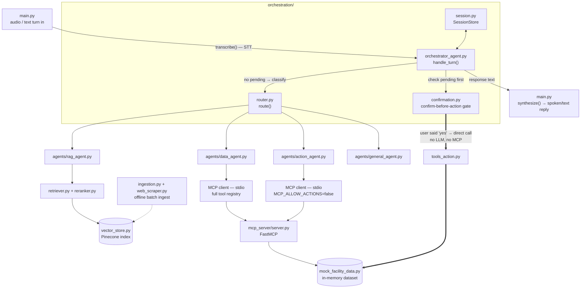
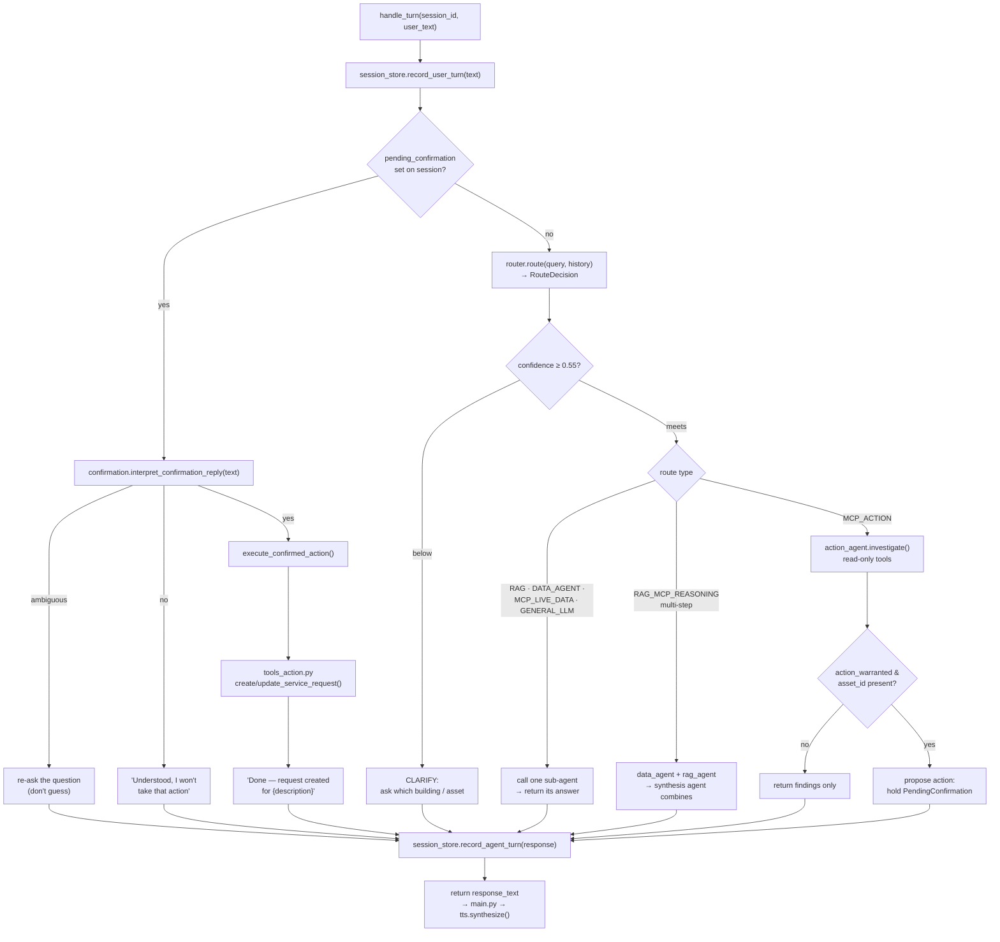
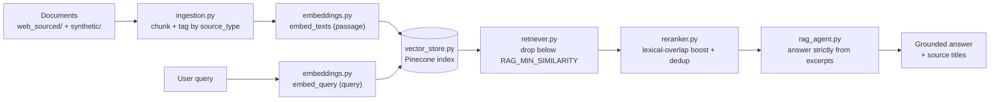
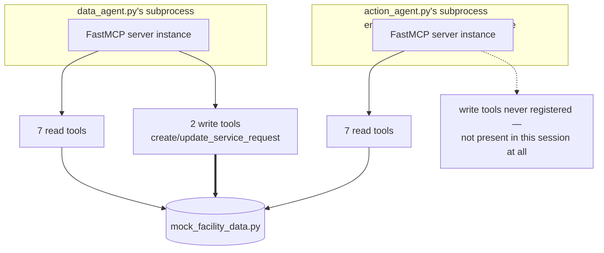

# Nectar Voice Agent

An autonomous voice AI agent for Nectar's Intelligent Facilities Platform. A facility
operator speaks (or types) a request; the agent transcribes it, classifies intent, pulls
whatever mix of live facility data and documentation the request needs, reasons over it,
and — for anything that would change facility state — proposes the action and waits for
an explicit "yes" before it ever writes anything.

## Table of contents

1. [Architecture](#architecture)
2. [Setup instructions](#setup-instructions)
3. [Environment configuration](#environment-configuration)
4. [Design decisions](#design-decisions)
5. [Assumptions](#assumptions)
6. [Agent workflow](#agent-workflow)
7. [LLM routing strategy](#llm-routing-strategy)
8. [RAG architecture](#rag-architecture)
9. [MCP architecture](#mcp-architecture)

---

## Architecture

### Component map

Every arrow below is a real process or network boundary, not a suggestion. In particular,
the agent that *investigates* a facility issue and the code that *writes* a service
request are physically separate — different tool registries in different subprocesses —
not just two different prompts.



Two agents each spawn their **own** `python -m nectar_agent.mcp_server.server`
subprocess over stdio — they are not sharing a server. The action agent's subprocess is
launched with `MCP_ALLOW_ACTIONS=false`, so `mcp_server/server.py` never registers
`create_service_request` / `update_service_request` in that process at all. See
[MCP architecture](#mcp-architecture) for why this matters.

### Folder structure

```
nectar-voice-agent/
├── README.md
├── requirements.txt / pyproject.toml / .env.example
├── docs/                      architecture, design decisions, sample conversations, evaluation
├── data/knowledge_base/
│   ├── web_sourced/            scraped from nectarit.com
│   └── synthetic/               8 authored HVAC/chiller/AHU/safety/etc. documents
├── src/nectar_agent/
│   ├── config.py                central pydantic-settings configuration
│   ├── main.py                  voice-turn entry point
│   ├── voice/                   stt.py, tts.py, audio_utils.py
│   ├── orchestration/           orchestrator_agent.py, router.py, session.py, confirmation.py
│   ├── agents/                  rag_agent, data_agent, action_agent, general_agent
│   ├── rag/                     web_scraper, ingestion, embeddings, vector_store,
│   │                             retriever, reranker
│   ├── mcp_server/               server.py, tools_read.py, tools_action.py,
│   │                              mock_facility_data.py
│   ├── models/                   routing.py, conversation.py, domain.py
│   └── prompts/                  one system-prompt module per LLM-driven agent
├── scripts/                      check_setup.py, ingest_knowledge_base.py, run_demo.py
└── tests/                        36 tests across router, RAG, MCP tools, confirmation, e2e
```

---

## Setup instructions

### Requirements

- Python 3.11+
- Two free API keys (neither needs a credit card) — see [Environment configuration](#environment-configuration)

### Install

```bash
git clone <this-repo>
cd nectar-voice-agent
python -m venv .venv
source .venv/bin/activate        # Windows: .venv\Scripts\activate
pip install -r requirements.txt
cp .env.example .env
# edit .env and fill in GEMINI_API_KEY and PINECONE_API_KEY
```

`requirements.txt` targets `pydantic-ai>=2.35.3` and its current **toolset-based** MCP
API (`pydantic_ai.mcp.MCPToolset` / `StdioTransport`, `Agent(toolsets=...)`,
`result.output`). This is a hard requirement, not a style choice: the older
`MCPServerStdio` / `Agent(mcp_servers=...)` / `result.data` surface from earlier
`pydantic-ai` releases does not support Gemini's `thought_signature` tool-calling
protocol and returns HTTP 400 on any multi-turn tool call — which is every turn
`data_agent.py` and `action_agent.py` make. If you see that error, check
`pip show pydantic-ai` and `pydantic_ai.mcp` before assuming the code is broken.

### Verify credentials before ingesting anything

```bash
python scripts/check_setup.py
```

Confirms `.env` is found, both keys are present and well-formed, Pinecone authenticates,
and your Gemini model still has daily quota — and prints a specific fix for whatever
fails. Costs one Gemini request.

### Ingest the knowledge base

The RAG agent has nothing to retrieve until this has run once:

```bash
python scripts/ingest_knowledge_base.py
```

Scrapes `nectarit.com`, chunks every document under `data/knowledge_base/` (both
sources), embeds them, and upserts into Pinecone — creating the index if it doesn't
exist yet. Re-run it (add `--skip-scrape` to skip re-hitting the website) whenever the
documents change.

### Run it

```bash
# fastest way to exercise the full pipeline, no audio needed
python scripts/run_demo.py --text

# single-turn: pre-recorded file in, audio file out
python scripts/run_demo.py --voice --input recording.wav --output response.mp3

# fully spoken: real microphone in, real speakers out
python scripts/run_demo.py --live

# run the MCP server standalone (for inspection with an MCP client)
python -m nectar_agent.mcp_server.server

# tests — self-contained, no API keys or network required
pytest -q
```

### Troubleshooting

**`401 Unauthorized` from Pinecone** — almost always a copy-paste artifact (a duplicated
leading character, wrapping quotes, a trailing space). Pinecone keys start with `pcsk_`;
`Settings` validates this at load time and names the exact problem.

**`429` / daily quota exhausted from Gemini** — the key is valid, you've used today's free
requests. Usually caused by a `-latest` model alias, which silently resolves to a preview
model with a much lower daily limit. Pin an explicit stable model instead (see
[Environment configuration](#environment-configuration)). Check live limits at
[aistudio.google.com/rate-limit](https://aistudio.google.com/rate-limit).

**`Index dimension mismatch`** — the Pinecone index was created with different dimensions
than `EMBEDDING_DIMENSIONS`. Happens when switching embedding providers (Pinecone = 1024,
OpenAI = 1536). Delete the index and re-run ingestion.

---

## Environment configuration

All settings live in one `pydantic-settings` model (`src/nectar_agent/config.py`) so a
missing or malformed value fails fast at startup instead of surfacing as a confusing
error mid-conversation. Copy `.env.example` to `.env` and fill in the two required keys
— everything else already has a working free-tier default.

| Variable | Default | Purpose |
|---|---|---|
| `GEMINI_API_KEY` | *(required)* | Google AI Studio key — free, no card. Copied into `GEMINI_API_KEY` env for Pydantic AI's provider. |
| `OPENAI_API_KEY` | *(blank)* | Only needed if `LLM_MODEL_*` or `EMBEDDING_PROVIDER` is switched to `openai:*`. |
| `LLM_MODEL_ROUTER` | `google:gemini-3.5-flash` | Model used for intent classification — kept swappable independently of the reasoning model so a cheaper model can be pinned here. |
| `LLM_MODEL_REASONING` | `google:gemini-3.5-flash` | Model used by the RAG, data, action, general, and synthesis agents. |
| `PINECONE_API_KEY` | *(required)* | Pinecone key — free Starter plan, no card. |
| `PINECONE_INDEX_NAME` | `nectar-facility-kb` | Vector index name; created automatically on first ingestion if missing. |
| `PINECONE_CLOUD` / `PINECONE_REGION` | `aws` / `us-east-1` | Serverless spec. The free Starter tier only supports `us-east-1`. |
| `EMBEDDING_PROVIDER` | `pinecone` | `pinecone` (hosted inference, reuses the Pinecone key) or `openai`. |
| `EMBEDDING_MODEL` | `multilingual-e5-large` | Must match the provider — `text-embedding-3-small` for OpenAI. |
| `EMBEDDING_DIMENSIONS` | `1024` | Must match the embedding model — `1536` for OpenAI's. Changing this requires re-creating the Pinecone index. |
| `STT_PROVIDER` | `faster-whisper` | `faster-whisper` (local, free) / `whisper` (OpenAI API) / `deepgram`. |
| `FASTER_WHISPER_MODEL` | `base` | `tiny` \| `base` \| `small` \| `medium` \| `large-v3`. |
| `TTS_PROVIDER` | `edge-tts` | `edge-tts` (free) / `elevenlabs` / `aws`. |
| `EDGE_TTS_VOICE` | `en-US-AriaNeural` | Voice name; `edge-tts --list-voices` lists options. |
| `DEEPGRAM_API_KEY` / `ELEVENLABS_API_KEY` / `ELEVENLABS_VOICE_ID` | *(blank)* | Only needed for those specific providers. |
| `RAG_TOP_K` | `5` | Chunks retrieved per query before reranking. |
| `RAG_MIN_SIMILARITY` | `0.30` | Minimum cosine similarity for a chunk to count as relevant. |
| `RAG_CHUNK_SIZE` / `RAG_CHUNK_OVERLAP` | `800` / `120` | Target characters per chunk and overlap between chunks. |
| `ROUTER_MIN_CONFIDENCE` | `0.55` | Below this, the router's guess is overridden to `CLARIFY`. |
| `ORCHESTRATOR_MAX_STEPS` | `8` | Hard cap on sub-agent/tool calls per turn. |
| `REQUIRE_CONFIRMATION_FOR_ACTIONS` | `true` | Declared for future use — see [Assumptions](#assumptions); the confirmation gate is currently unconditional regardless of this flag. |
| `NECTAR_WEBSITE_URL` | `https://www.nectarit.com/` | Root URL scraped for the web-sourced half of the knowledge base. |
| `MCP_SERVER_HOST` / `MCP_SERVER_PORT` | `127.0.0.1` / `8765` | Only used when the MCP server is run with `MCP_TRANSPORT=http` instead of the default stdio. |

`Settings` also validates key *shape* at load time (Pinecone keys must start with
`pcsk_`, an OpenAI-shaped `sk-...` key pasted into `GEMINI_API_KEY` is rejected) so a
copy-paste mistake fails immediately with a specific message instead of a mysterious 401
three steps later.

---

## Design decisions

**Bounded, explicit orchestration instead of an open-ended planning loop.**
`orchestrator_agent.handle_turn()` is hand-written control flow — route → gather →
gather more if the route calls for it → synthesize → propose confirmation — rather than
"let the LLM decide every next action in a loop until it stops." This keeps step count
predictable (capped by `ORCHESTRATOR_MAX_STEPS`), keeps the confirmation gate impossible
to route around by construction, and keeps the reasoning path auditable turn-by-turn. The
trade-off: it can't discover a genuinely novel multi-hop investigation the fixed
`RouteType` set doesn't anticipate. `RouteDecision.is_multi_step` is the seam where a more
open-ended planner could be substituted later without touching the sub-agents.

**The action agent cannot call write tools — not "is told not to."** An earlier design
considered one MCP server exposing both read and write tools to every agent, relying on
the action agent's prompt to never call the write ones. Rejected: a prompt is not a
security boundary. Instead `mcp_server/server.py` reads `MCP_ALLOW_ACTIONS` from its
process environment at import time and only registers the write tools when it isn't
explicitly disabled; `agents/action_agent.py` launches its subprocess with
`MCP_ALLOW_ACTIONS=false`. There is no code path by which that agent could call a write
tool, regardless of what the model decides. See [MCP architecture](#mcp-architecture).

**Two knowledge-base sources, tagged by origin.** `nectarit.com` is a marketing site —
no chiller manuals, fault codes, or troubleshooting steps. A website-only knowledge base
couldn't answer the kind of facility-technical question this agent exists for. So
`data/knowledge_base/` has both a `web_sourced/` set (scraped, for platform/product
questions) and a `synthetic/` set (eight authored technical documents — HVAC operating
procedures, chiller manual, AHU troubleshooting, maintenance procedures, safety
instructions, equipment specs, facility policies, troubleshooting FAQs), tagged
`source_type` on every vector so answers can honestly cite which kind of source they
came from.

**Confirmation-reply interpretation is a keyword classifier, not an LLM call.**
`confirmation.interpret_confirmation_reply()` is deliberately deterministic: the
yes/no/ambiguous decision that gates a write action shouldn't depend on model behavior.
It errs toward `None` (re-ask) on anything it doesn't recognize rather than guessing
either way.

**Reranking is lexical, not a cross-encoder.** `rag/reranker.py` boosts Pinecone's cosine
similarity with a cheap word-overlap score and dedupes near-identical chunks. Kept
dependency-light for this prototype; the function signature is written so a real
reranker model could be dropped in without touching callers.

**Router and reasoning models are separate config values even though they default to the
same model.** `LLM_MODEL_ROUTER` and `LLM_MODEL_REASONING` are independently
configurable specifically so a cheaper/faster model can be pinned to routing without
touching the model every sub-agent reasons with — see
[LLM routing strategy](#llm-routing-strategy).

---

## Assumptions

- **In-memory session store and in-memory facility dataset.** `orchestration/session.py`
  and `mcp_server/mock_facility_data.py` both reset on process restart and don't share
  state across multiple server instances. Both sit behind small interfaces
  (`SessionStore`, the plain-function tool layer) specifically so they can be swapped for
  Redis/a database and a real BMS/SCADA/IoT gateway respectively without changing any
  calling code.
- **`REQUIRE_CONFIRMATION_FOR_ACTIONS` is declared but not yet read anywhere.** The
  confirmation gate in `orchestration/confirmation.py` is unconditional today — every
  `MCP_ACTION` recommendation becomes a `PendingConfirmation` regardless of this setting.
  Treat the setting as reserved for a future "trusted automation" mode, not as something
  that currently changes behavior.
- **Single-process, single-machine deployment.** The MCP server is spawned as a stdio
  subprocess per agent per process — there's no shared server across multiple app
  instances, and no auth/network hardening on the optional HTTP transport
  (`MCP_TRANSPORT=http`), since it isn't exposed publicly in this design.
- **STT/TTS providers beyond the free defaults are wired but not exercised in automated
  tests** (they require live keys and audio fixtures). The text-mode entry point
  (`process_text_turn`) exercises every layer downstream of transcription identically to
  the voice path, so it stands in for STT/TTS coverage in `pytest -q`.
- **The knowledge base must be (re-)ingested manually.** There's no file-watcher or
  startup check that the Pinecone index is populated — `scripts/ingest_knowledge_base.py`
  is assumed to have been run at least once, and again after editing
  `data/knowledge_base/`.

---

## Agent workflow

Per user turn, `orchestration/orchestrator_agent.handle_turn()` runs the flow below.
Every branch — a re-ask, a cancellation, a completed write, a clarifying question, or an
agent's answer — converges back through the same two calls
(`record_agent_turn` → return), so no path skips being recorded to session history.



The one thing worth noticing: even when `MCP_ACTION` decides `action_warranted=True`,
this turn ends by **asking**, not by creating the ticket. The write only happens on a
*later* turn, and only through the left-hand branch — `confirmation.py` is the sole path
to `tools_action.py` anywhere in the codebase.

---

## LLM routing strategy

`orchestration/router.py` runs a small, fast model (`LLM_MODEL_ROUTER`) on every turn to
classify intent into a structured `RouteDecision` — never free text, so the orchestrator
branches on it programmatically rather than parsing a guess:

| Route | Destination | When |
|---|---|---|
| `rag` | RAG Agent | Documentation/"why"/"how" questions answerable from the knowledge base alone. |
| `mcp_live_data` / `data_agent` | Data Agent | A live value or an aggregate/summary over live facility data. |
| `rag_mcp_reasoning` | Data Agent + RAG Agent + synthesis agent | Needs both live data *and* documentation combined into one explanation. |
| `mcp_action` | Action Agent | The user is asking for an investigation that may end in a maintenance decision. |
| `general_llm` | General Agent | Small talk, greetings, anything not about facility operations. |
| `clarify` | — | Router isn't confident enough to act on its own guess. |

**Confidence gating.** `RouteDecision.confidence` (0–1) is checked against
`ROUTER_MIN_CONFIDENCE` (default `0.55`) in `enforce_confidence_threshold()`. Below
threshold, the decision is coerced to `clarify` regardless of what route the model
guessed — the orchestrator asks a clarifying question instead of acting on a low-
confidence guess.

**Misrouting is contained, not just prevented.** Sub-agents are scoped tightly enough
that even a routing miss tends to fail loudly rather than fabricate an answer: the RAG
agent only has a retrieval tool (never live-data tools), so a misrouted live-data
question surfaces as "I don't have documentation covering that" instead of an invented
number.

**Tool failures surface as data, not crashes.** Every MCP tool function returns a typed
`{"error": "..."}` dict rather than raising, so a failed or unknown lookup is something
the LLM can reason about and report honestly.

**Cost/latency.** The router's cheap model runs on every turn; the (potentially more
expensive) reasoning model is only invoked for the specific sub-agent(s) the chosen route
actually needs — a plain live-data lookup never pays for two calls to the expensive model
the way a single-model design would. `LLM_MODEL_ROUTER` and `LLM_MODEL_REASONING` default
to the same free-tier model today, but are independent settings for exactly this reason.

---

## RAG architecture



**Two sources, one pipeline.** `data/knowledge_base/web_sourced/` (scraped from
`nectarit.com` by `rag/web_scraper.py`) covers platform/product/company questions.
`data/knowledge_base/synthetic/` (eight authored documents) covers the facility-technical
questions the website doesn't publish — chiller fault codes, AHU airflow thresholds,
troubleshooting steps. Both are ingested by the same `rag/ingestion.py` pipeline and
tagged `source_type: web_scrape` / `synthetic_doc` on every stored vector, so an answer's
provenance is always recoverable.

**"Not in the knowledge base" is handled at two layers, not one.**
`retriever.retrieve()` filters out anything below `RAG_MIN_SIMILARITY` before the LLM
ever sees it; on top of that, `rag_agent.py`'s retrieval tool returns the literal string
`"NO_RELEVANT_DOCUMENTS_FOUND"` when nothing qualifies (or if retrieval itself throws),
and its system prompt (`prompts/rag_prompt.py`) instructs it to say so plainly rather than
paper over the gap with general knowledge.

**Embeddings are provider-swappable but dimension-locked.** `EMBEDDING_PROVIDER=pinecone`
(default) uses Pinecone's hosted `multilingual-e5-large` (1024-dim) with `input_type`
distinguishing passage-indexing from query-embedding for better retrieval quality;
`EMBEDDING_PROVIDER=openai` uses `text-embedding-3-small` (1536-dim). Switching providers
changes vector dimensionality, so the Pinecone index must be deleted and re-created (`
scripts/ingest_knowledge_base.py` does this automatically via
`vector_store.ensure_index_exists()`).

---

## MCP architecture

`mcp_server/server.py` is a FastMCP application. It always registers seven read tools
from `tools_read.py` — `get_asset_details`, `get_asset_status`, `get_sensor_data`,
`get_energy_consumption`, `get_active_alerts`, `get_asset_relationships`,
`find_assets_by_location` — and conditionally registers two write tools from
`tools_action.py` — `create_service_request`, `update_service_request` — based on the
`MCP_ALLOW_ACTIONS` environment variable read **once, at import time**. Everything is
backed by an in-memory simulated dataset (`mock_facility_data.py`) standing in for a real
BMS/SCADA integration.

Two different Pydantic AI agents connect to this server as genuine MCP clients
(`pydantic_ai.mcp.MCPToolset` over `StdioTransport`, launching
`python -m nectar_agent.mcp_server.server` as a subprocess) — so tool calls go over the
actual Model Context Protocol, not a direct Python call, and each agent gets its **own**
server instance:



**Confirmation before action, enforced at three independent layers:**

1. **The action agent physically cannot call write tools.** Its subprocess registers only
   the read tools — there is no tool-calling path to `create_service_request` regardless
   of what the model decides, because the tool schema simply isn't in its MCP session.
2. **Exactly one function in the codebase is allowed to call the write tools:**
   `orchestration/confirmation.py:execute_confirmed_action`, invoked only after
   `interpret_confirmation_reply` classifies the user's reply as an explicit affirmative.
   An ambiguous reply re-asks rather than assuming either way. This call bypasses the
   LLM and MCP entirely — it's a direct Python function call into `tools_action.py`.
3. **The action agent's own output type has no execution path.** `ActionRecommendation`
   (`findings`, `action_warranted`, `asset_id`, `proposed_summary`) is a proposal, never a
   completed action. Turning a recommendation into a real tool call is the orchestrator's
   job, one turn later, gated on the user's next reply.

For a walkthrough of both a single-tool lookup and the full multi-step "investigate and
create a request if necessary" scenario, see `docs/architecture.md`. Design trade-offs are
covered in depth in `docs/design_decisions.md`; test coverage and manual routing-accuracy
checks are in `docs/evaluation_results.md`.
=======
# Nectar-IT-Agent
A voice-driven facility-operations agent: one router classifies each turn, four specialist sub-agents handle it, live facility data and a maintenance-write path run through the Model Context Protocol, and a knowledge base answers "why" questions through retrieval. 
>>>>>>> 2c2ca02323d6efab855ae04e5a591797df4fcc67
